# Detection automation method for data sets with Concept Drift and Scale-free natures
A data sets in security typified by malware and spam messages are constantly changing their nature according to time axis, so it is difficult to implement countermeasures permanently. In this paper, we focus on the Scale-free of a data set with the property of Concept-Drift and propose a method to detect while following automatically the change of data distribution.


First, I want to define some symbols. t is the current time, D(t) is the data-set on the current time. Da(t−n) is a data-set that can be used for learning, Db(t+m) is a data-set we want to detect. Da and Db has both "malignant" and "benign", are NOT labeled, but Da is [Scale-free](https://en.wikipedia.org/wiki/Scale-free_network). And these data-set is [Concept-Drift](https://en.wikipedia.org/wiki/Concept_drift), constantly changing. So we want to automatically detect a malignant in Db using Da.

## Quantitative data
I'll show an example of data-set Da. For example, it is an information of reported from some users regularly. You can not trust 100% reputation from users. Of course, many users accurately report malignant as a malignant, but not all users can judge it accurately. In some cases, many benignities may be included in there. Therefore, the first problem is to label it, which is to separate benign and malignant ones.

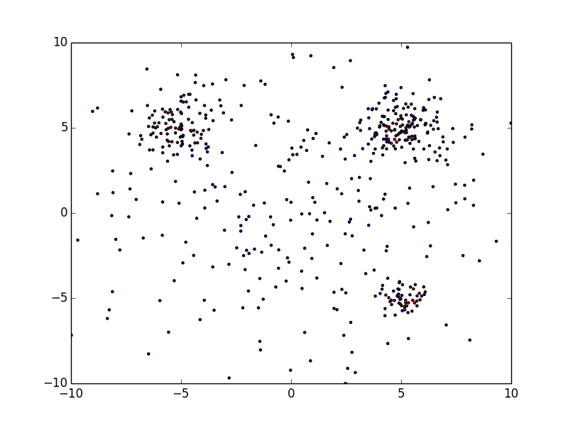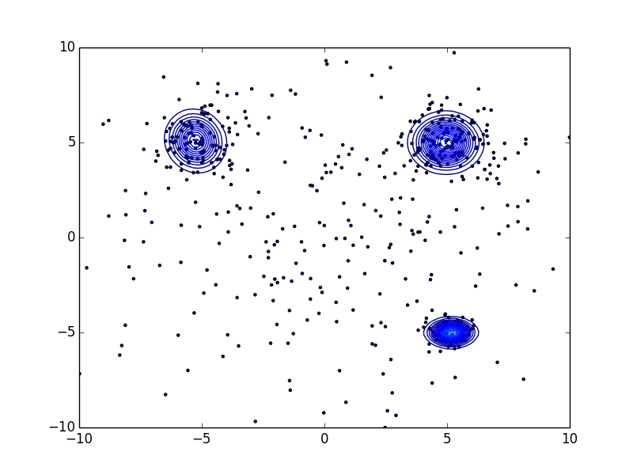

They are scattered throughout but the malignant ones gather themselves in some place. We want to find "N blue circles" in right figure (N=3 in this example) basing from a model we get with a data-set similar to the left figure. The data inside the blue circles are a malignant, the data outside of it are benign. In short, given data-set (that is Scale-free) like the one on the left figure, we want to draw a blue circle (an arbitrary number) in the right figure.
```
$ python load_dataset0-1.py sample0.txt
$ python load_dataset0-2.py sample0.txt
$ python load_dataset1-1.py sample1.txt
$ python load_dataset1-2.py sample1.txt
$ python load_dataset1-3.py sample1.txt
$ python load_dataset2-1.py sample2.txt sample3.txt
$ python load_dataset2-2.py sample3.txt
$ python load_dataset2-3.py sample3.txt 3
$ python load_dataset2-4.py sample2.txt sample3.txt 3
$ python load_dataset3-1.py sample4.txt
```
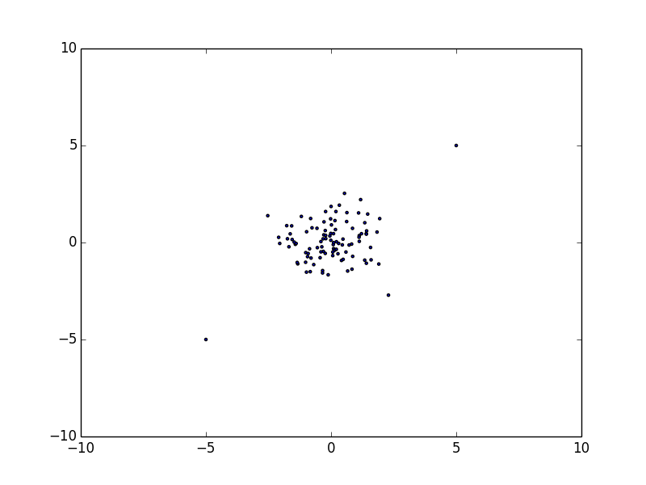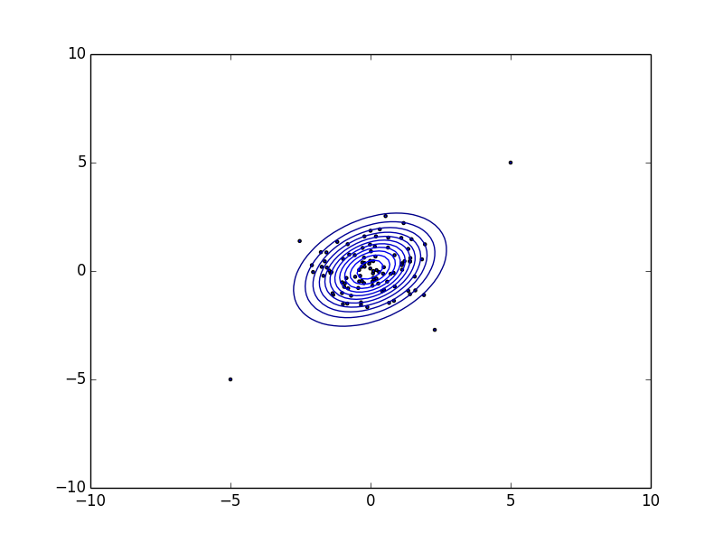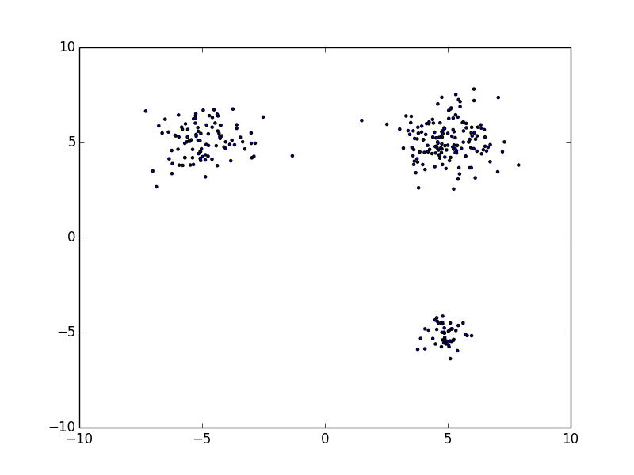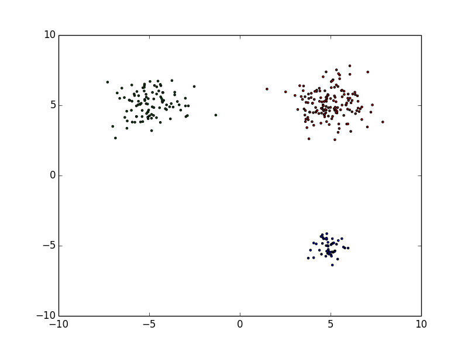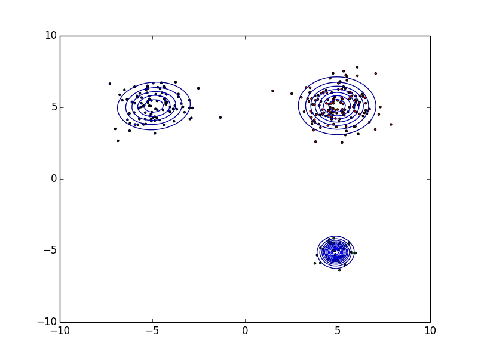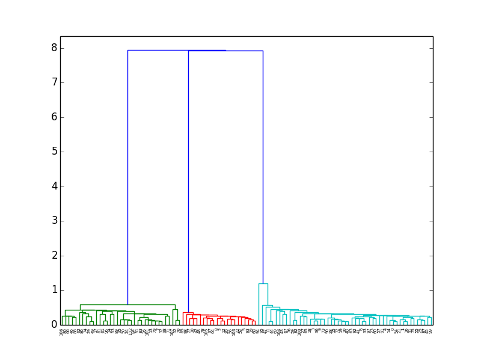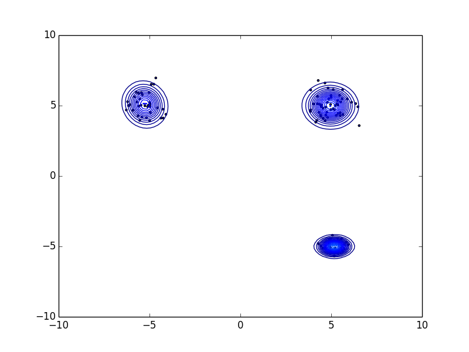

1. Delete scattered benign data (load_dataset2-1.py)
2. Count the number of clusters　
3. Set the number of clusters and find the center point of each clusters

This is automatable. Both Da and Db are Concept-Drift, but if you can label Da like this, you can use it to automatically detect some malignants in Db.

## Qualitative data
I also want to do same thing for qualitative data.
```
ECA__: "ECAEA", "ECAAD", "ECACA", "ECABB", "ECACA"
_BAB_: "FBABF", "ABABC", "DBABA"
Other: "ABCDE", "DDFEA", "BCDAA", "FFFED", "AAAAA", "EEEEE", "BBDBB"
```
This is a sample data-set. There are 5 questions, each with 6 patterns (A to F) answers. The problem is finding features that exist in as much (but not all) of the data as possible. In short, We want to find "ECA" and "BAB" from the sample data-set. If there is an algorithm that extracts the common parts of the 2 data, it is possible (refer to [qualitative_data1-1.py](https://github.com/kenjiaiko/secml/blob/master/qualitative_data1-1.py)).

## String
Next, I want to discuss about one-dimension array data, like string. We want to know a common substring or subsequence of malignant strings, so we could use the [Longest common substring](https://en.wikipedia.org/wiki/Longest_common_substring_problem) or [Longest common subsequence](https://en.wikipedia.org/wiki/Longest_common_subsequence_problem) for it. We can use the substring as a feature if we extract longest common substring/subsequence in some strings. The message containing the LCS has a high possibility of malignancy.

[Suffix trees](https://en.wikipedia.org/wiki/Suffix_tree) provide one of the first linear-time solutions for the Longest common substring problem. Likewise, using the Suffix tree, you can extract common (substring) features from messages. Please refer to [qualitative_data1-2.py](https://github.com/kenjiaiko/secml/blob/master/qualitative_data1-2.py).
```
// sample5.json
*ECA*: "FAECAEA", "BCCECAAD", "ECACA", "ECAB", "EECACA", "EECA", "ECAA"
*BAB*: "FBABFBA", "ABAB", "DCCCEFDBABA"
Other: "ABCDEDE", "DDFEADEF", "BCDAAB", "FFFEDE", "AAAAA", "EEE", "BBDBBD"
```

```
$ python qualitative_data1-2.py sample5.json 
ECA was included in 7 data.
BAB was included in 3 data.
ACA was included in 2 data.
...
```
Let's also consider about common subsequence of messages. If the number of generic input columns is arbitrary, Longest common subsequence is [NP-Hard](https://en.wikipedia.org/wiki/NP-hardness). So ingenuity may be necessary depending on the amount of data. Please refer to [qualitative_data1-3.py](https://github.com/kenjiaiko/secml/blob/master/qualitative_data1-3.py).
```
// sample6.json
*ECA*: "EfaCeAb", "bccECAb", "EaCcA", "ECbA", "aaECdA", "eECA", "ECAab"
*BAB*: "fBAdfBa", "aBAB", "BdcccefdAaBc", "abcdBAB"
Other: "abcdede", "ddfeadef", "bcdaab", "fffede", "aaaaa", "eee", "bbdbbd"
```

```
$ python qualitative_data1-3.py sample6.json 
ECA was included in 7 data.
ECb was included in 4 data.
BAB was included in 4 data.
ede was included in 3 data.
...
```

LCS is the one of the method to solve it, this is not the only solution. The important thing is to find features that exist in as much (but not all) of the data as possible.

## Image
How about two-dimension array data, like images. We also want to do same thing for Image. There are several research how to extract common features of images (ex: [Feature Detection and Description](https://docs.opencv.org/master/db/d27/tutorial_py_table_of_contents_feature2d.html), [Grad-CAM: Why did you say that? Visual Explanations from Deep Networks via Gradient-based Localization](https://github.com/ramprs/grad-cam/)).

I'd like to introduce a method of extracting similar parts in two images. When these similar parts (area) are detected using opencv, they are as shown on the below. From the result of opencv, the method of extracting similar areas on the two images, is [image_data1-1.py](https://github.com/kenjiaiko/secml/blob/master/image_data1-1.py).

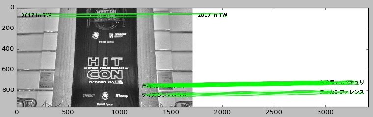

```
$ python image_data1-1.py saved/P_20171207_124559_HDR.jpg saved/P_20171207_124604_HDR.jpg
```

image_data1-1.py will output 2 images([saved/1.jpg](saved/1.jpg), [saved/2.jpg](saved/2.jpg)) that is extracted as similar parts in the two images.

<will add>

"Words" are features of strings, "Objects" are features of images. So (ideally) we want to use a object as a feature, but it is difficult. For example, [opencv](https://docs.opencv.org/master/d1/de0/tutorial_py_feature_homography.html) and [tensorflow](https://github.com/tensorflow/models/tree/master/research/object_detection) have the function for "object detection". However it seems that it is impossible to perfectly detect objects (ex: [Deep neural networks are easily fooled](http://www.evolvingai.org/fooling)). In addition, "object detection" is very heavy.

 Images are different from strings, and it is difficult to extract features. Automation is possible, but you will need to be concerned about FalsePositive.

## False Positive
False-Positive rate should be less than 0.01% in security case. For example, Neural Network and SVM are very powerful algorithms, but False-Positive can not be less than 0.01%. And it is also difficult to investigate the cause of False-Positive. Our system have to update detection algorithm for keeping quality of it on a regular basis, however many advanced algorithms are not suitable for this. You should be concerned or be able to do the following even if you use advanced algorithms for machine learning.

* False-Positive can be reduced to 0.01% or less
* You can investigate the cause (reason) of False-Positive if you found a data of False-Positive
* For automation, the system can update learning-data on a regular basis

False positivity means that there is a "benign class (red circle)" in the "malicious class (blue circle)".

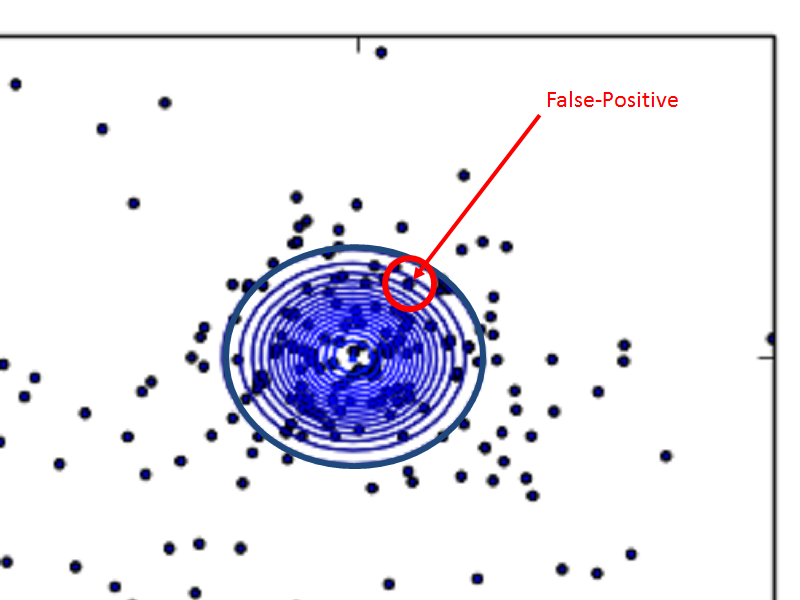

So, one good way to lower False-Positive is to add a white list filter. Collect only the erroneously detected data-sets and extract their features, make white list filter (white list filter should be simple). The method of combining two or more algorithms with AND/OR is often effective for lowering/raising False-Positive/True-Positive (False-Positive and True-Positive are trade offs).
 
## Scale-free and Concept-Drift
Finally I would like to mention the relationship between Scale-free and Concept-Drift.

Many types of data-sets follow Scale-free, it is not related to malignant users. Because Scale-free is a characteristic that exists regardless of Security, we can not discuss this within the scope of Security only. Therefore, Scale-free is a precondition in this article. On the assumption of scale-free, I'd like to talk about Concept-Drift.

The [rank size rule](https://en.wikipedia.org/wiki/Rank-size_distribution) states that for cities exceeding some size in a particular country, the relationship between size and rank of cities is given by:

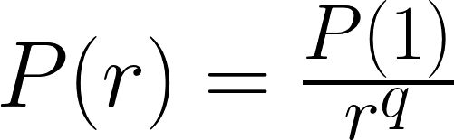

P(r) is population of r-th ranked city, q is a coefficient. The rank size rule is also observed in fields other than cities. We rank in order from high reported count, and the reported count of the r-th place, is P(r). In the reported dataset without a malignant, P(1) is very small. And as malignant increases, the count of reported of top-ranks increases.

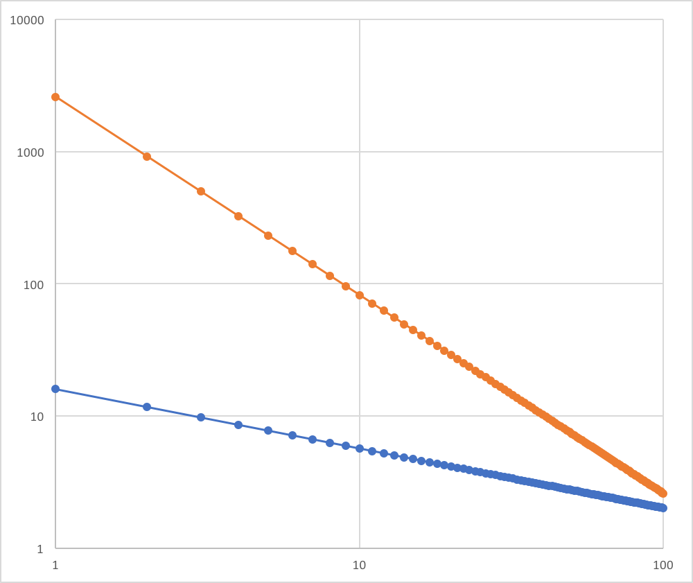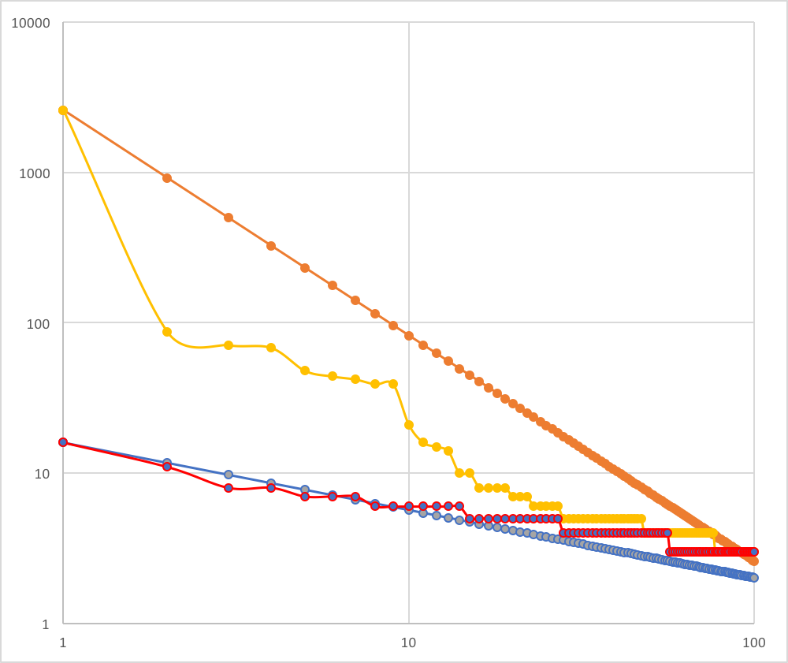

In the left image, the blue is a model of reported count without a malignant, the orange is a model of reported count with malignant. The blue's P(1) is 16, q is 0.45. The orange's P(1) is 2596, q is 1.5. 

Look at the right image. Yellow and red (not linear one) are a real reported data. The orange is a model of the yellow, the blue is a model of the red. Blue and red approximate, but orange and yellow are not. What is this gap between orange and yellow?

Actually, as malignant increases, it moves away from scale-free. To be accurate, the difference between 1st place and others will be more bigger. That is, the graph flows down. If malignant is not blocked, yellow will grow downwards and it will be maintained. Concept-Drift does not occur in this state.

Next, the system will block some malignant (for example, top-10 of reported), then some malignants will (have to) change so that it will not be detected. As a result, it shifts to a structure where multiple malignants occupy the top. This is start of Concept-Drift on security.

The graph goes down if the difference between 1st and 2nd is big, it goes up if it is small. The difference between 1st and 2nd is small, means the system have blocked malignants at the moment.

 Scale-free is a principle of nature, Concept-Drift is human intervention. And Scale-free will have slided by intervention of malignant.

## Reference
* [1] Barabási, Albert-László and . Albert, Emergence of scaling in random networks, Science, 1999
* [2] Game, J.; Zliobaite, I.; Bifet, A.; Pechenizkiy, M.; and Bouchachia, A. 2014. A Survey on Concept Drift Adaptation. ACM Computing Surveys (CSUR) 46(4):44.
* [3] M. Iwamura, M. Itoh, and Y. Muraoka, Automatic Malware Classification System Based on Similarity of Machine Code Instructions, CSS, 2010
* [4] P. Weiner (1973). Linear pattern matching algorithm. 14th Annual IEEE Symposium on Switching and Automata Theory. pp. 1-11.
* [5] Edward M. McCreight (1976). A Space-Economical Suffix Tree Construction Algorithm. Journal of the ACM 23 (2): 262–272.
* [6] E. Ukkonen (1995). On-line construction of suffix trees. Algorithmica 14 (3): 249–260.
* [7] R. Giegerich and S. Kurtz (1997). From Ukkonen to McCreight and Weiner: A Unifying View of Linear-Time Suffix Tree Construction. Algorithmica 19 (3): 331–353.
* [8] Nguyen A, Yosinski J, Clune J. Deep Neural Networks are Easily Fooled: High Confidence Predictions for Unrecognizable Images. In Computer Vision and Pattern Recognition (CVPR '15), IEEE, 2015. (http://www.evolvingai.org/fooling)
