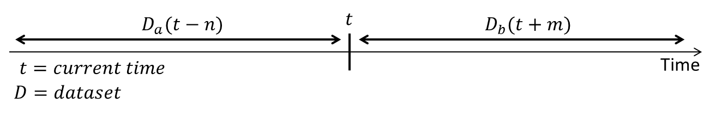

# Basis
A data sets in security typified by malware and spam messages are constantly changing their nature according to time axis, so it is difficult to implement countermeasures permanently. In this paper, we focus on the Scale-free of a data set with the property of Concept Drift and propose a method to detect while following automatically the change of data distribution.



First, I want to define some symbols. t is the current time, D(t) is the data-set on the current time. Da(t−n) is a data-set that can be used for learning, Db(t+m) is a data-set we want to detect. Da and Db has both "malignant" and "benign", are NOT labeled, but Da is [Scale-free](https://en.wikipedia.org/wiki/Scale-free_network). And these data-set is [Concept-Drift](https://en.wikipedia.org/wiki/Concept_drift), constantly changing. So we want to automatically detect a malignant in Db using Da.

I'll show an example of data-set Da. For example, it is an information of reported from some users regularly. You can not trust 100% reputation from users. Of course, many users accurately report malignant as a malignant, but not all users can judge it accurately. In some cases, many benignities may be included in there. Therefore, the first problem is to label it, which is to separate benign and malignant ones.


They are scattered throughout but the malignant ones gather themselves in some place. We want to find "N blue circles" in right figure (N=3 in this example) basing from a model we get with a data-set similar to the left figure. The data inside the blue circles are a malignant, the data outside of it are benign. In short, given data-set (that is Scale-free) like the one on the left figure, we want to draw a blue circle (an arbitrary number) in the right figure.

```
$ python load_dataset0-1.py sample0.txt
$ python load_dataset0-2.py sample0.txt
$ python load_dataset1-1.py sample1.txt
$ python load_dataset1-2.py sample1.txt
$ python load_dataset1-3.py sample1.txt
$ python load_dataset2-1.py sample2.txt sample3.txt
$ python load_dataset2-2.py sample3.txt
$ python load_dataset2-3.py sample3.txt 3
$ python load_dataset2-4.py sample2.txt sample3.txt 3
```


1. Delete scattered benign data (load_dataset2-1.py)
2. Count the number of clusters　
3. Set the number of clusters and find the center point of each clusters

This is automatable.

